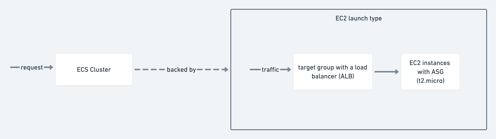

# Nodejs Application infrastucture

This is the documentation decribing the infrastucture.



## Checklist

- [x] Application must be public on the internet and accessible on port 80.
- [x] fault tolerance with high availability.
- [x] Use AWS as the cloud provider, but only free-tier resources are allowed.
- [x] The solution should be easy to manage/maintain.
  - [x] preconfigured autoscaling
  - [x] terraform managed configuration
  - [x] optional to use fargate (serverless)
- [x] Deliver all code/documentation required to deploy the infrastructure and the application in compressed file.

### Optional

- [x] Provide a repository of a Control Version System like Github/Gitlab/Bitbucket instead of the previous compressed file
- [x] Application logs are centralised on a different service (cloudwatch)
- [x] The solution can be up and running by executing a single command/script
- [x] Management access (SSH or RDP) to the servers are allowed only for restricted IPs
- [x] Design and implement a process for deploying new application versions with no downtime

## Provision the infrastructure

### Prerequisites

Terraform is the CI/CD for infrastructure in which there are still some steps for first time setup.

1. create your own ssh key and then generate the public key and replace file `public.pub` under `assets/`
2. create a s3 bucket and replace the bucket name https://github.com/s99100532/nodejs-infra/blob/master/terraform/main.tf#L17

### Provisioning

1. Intall `terraform` and `aws-cli` according to [here](https://learn.hashicorp.com/tutorials/terraform/install-cli) and [here](https://docs.aws.amazon.com/cli/latest/userguide/getting-started-install.html).

2. (Optional if use default AWS profile) Create a named AWS profile for terraform to provision the infrastructure.

```sh
# configure the AWS credential
aws configure --profile $YOUR_PROFILE_NAME
# setup default profile for current session
export AWS_PROFILE=$YOUR_PROFILE_NAME
```

3. provision the infrastructure

```sh
# initialize the dependency
terraform init
# review the infrastructure change
terraform plan
# provision the infrastructure
terraform apply
```

## Test autoscaling

1. Install k6 ([tutorial](https://k6.io/docs/getting-started/installation/))

2. go to `load_test` directory from repository root and run the script

```sh
# assume you are in repository root.
cd load_test
k6 run -e MY_URL=$MY_URL script.js
```

3. the cluster will be scaled in 3 minutes.

## SSH to the container

There is a [feature](https://aws.amazon.com/tw/blogs/containers/new-using-amazon-ecs-exec-access-your-containers-fargate-ec2/) that allow direct ssh access to the container but require extra setup. So we take a simple approach this time.

1. ssh to the container machine (ec2) in which the task running.
2. access the container use `ash`. 
```sh
docker exec -it $CONTAINER_ID ash
```

if want to limit the ip to access, update `ssh_limit_ips` in https://github.com/s99100532/nodejs-infra/blob/master/terraform/main.tf#L39
For example, if the only ip to access is `113.108.18.87`, then set `ssh_limit_ips` to `["113.108.18.87/32"]`


## Deploy the code change
- Submit a PR to `master` branch
- Push to `master` branch

> hints: add `[skip ci]` in commit message will skip the CI.